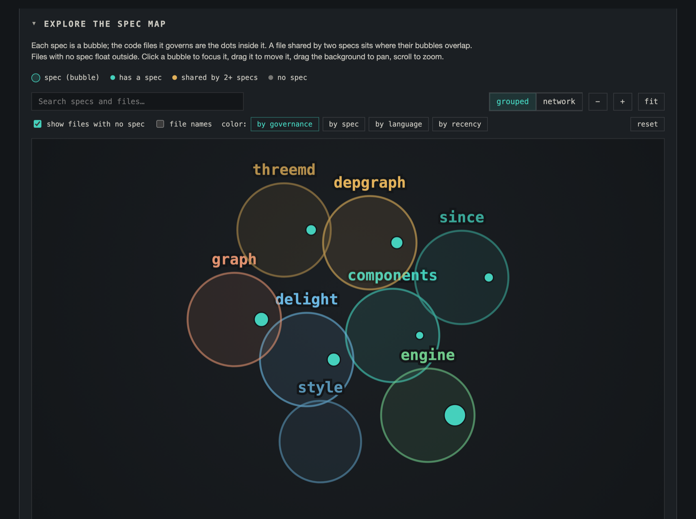
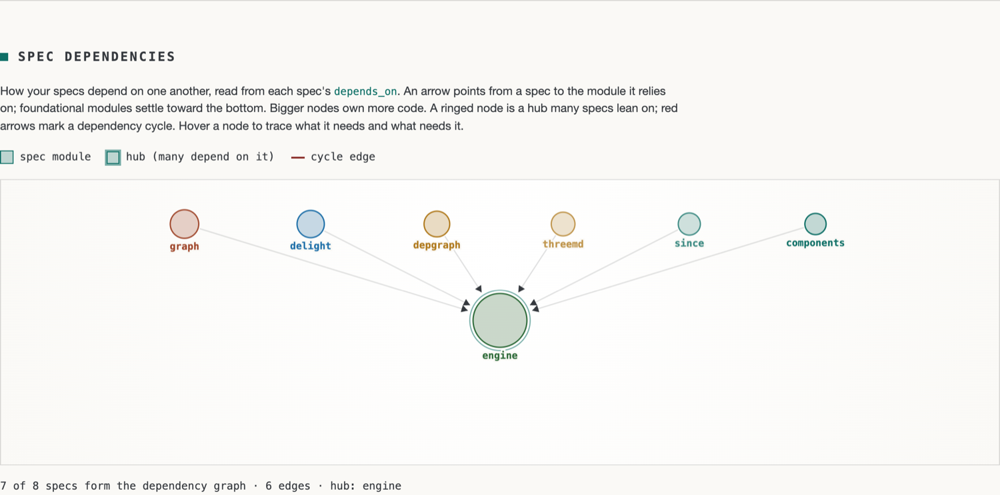
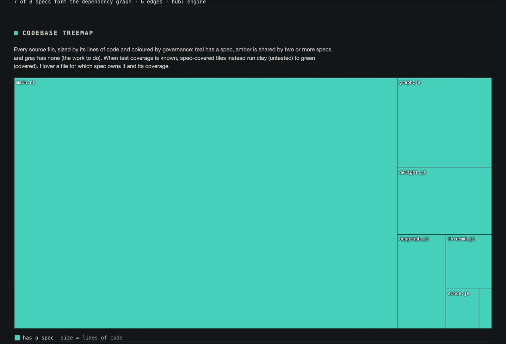
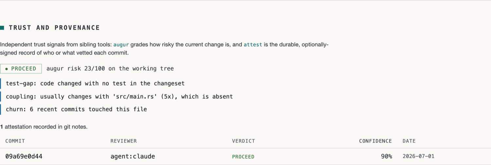

# fledge-plugin-atlas

<!-- ATLAS:START — badges below are regenerated on every push to main by .github/workflows/pages.yml -->
[](https://corvidlabs.github.io/fledge-plugin-atlas/)
[](https://corvidlabs.github.io/fledge-plugin-atlas/)
[](https://corvidlabs.github.io/fledge-plugin-atlas/)
[](https://corvidlabs.github.io/fledge-plugin-atlas/)
<!-- ATLAS:END -->

🗺️ Render your project's specs, code, and their overlap as a single
self-contained interactive HTML **atlas**, for humans, plus the same model as
JSON, for agents. Look at a codebase an agent has been building and actually see
what is there: which specs govern which files, how much of the code is under
contract, what is untested, and what has drifted.

One command produces a single HTML file (no server, no CDN, no network) built
around an interactive force-directed graph, plus the same model as JSON for
agents.

```
fledge atlas                 # write ./<project>.atlas.html
fledge atlas path/to/repo    # analyze another project
fledge atlas --open          # write, then open in your browser
fledge atlas --json          # print the full model as JSON (for agents / piping)
fledge atlas --review        # JSON: specs that likely need review (for agents)
fledge atlas --spec <MODULE> # JSON: one spec + its doc & companion contents
fledge atlas --owns <PATH>   # JSON: which specs govern a file (reverse index)
fledge atlas --since <REF>   # JSON: specs touched by changes since a git ref
fledge atlas --gaps          # JSON: coverage-gap worklist (needs an lcov report)
fledge atlas --scaffold      # print a *.spec.md stub for the top orphan cluster
fledge atlas --3md           # write a .3md spec deck (open in the 3md viewer)
fledge atlas --timeline      # write a .3md timeline, one plane per week of git history
fledge atlas -o report.html  # choose the output path
```

## The atlas, on itself

This repo dogfoods what it measures. Its own [`specs/`](specs/) describe every
source file, so `fledge atlas` run here reports **100% of the code under a spec,
0 orphans, 0 phantoms**: the screenshots below are that self-atlas. (Optional:
[`augur`](https://github.com/CorvidLabs/augur) and
[`attest`](https://github.com/CorvidLabs/attest) light up the trust panel when
they have data; neither is required to build or run the atlas.)

These three cards are **re-rendered on every push to `main`** by the Pages
workflow (`fledge atlas --svg …`) and served from GitHub Pages as standalone
SVG, so they always reflect the current `main` rather than a saved snapshot:

<!-- live SVG components, regenerated by .github/workflows/pages.yml on each deploy -->
<p></p>
<p></p>
<p></p>

The screenshots that follow show the interactive HTML views (the force-directed
graph and the trust panel), which the static SVG cards above do not replicate.

The spec and code graph: each `*.spec.md` is a bubble, the files it governs are
the dots inside, coloured by governance:



The spec dependency DAG, read from each spec's `depends_on:`. Every spec here
depends on the `engine`, which settles to the bottom as the hub:



The codebase treemap, coloured by governance (teal = has a spec, gray = none):



With [`augur`](https://github.com/CorvidLabs/augur) and
[`attest`](https://github.com/CorvidLabs/attest) present, the trust panel fills
in on its own: a change-risk verdict for the working tree, and the signed
provenance of recent commits, read straight from git notes:



Regenerate any time with `fledge atlas --open`.

### 3md spec deck

`fledge atlas --3md` writes a [`.3md`](https://github.com/CorvidLabs/3md) file: a
stack of planes along a `layer` axis, with an overview plane (z=0) and one plane
per spec (biggest first), cross-linked with `[[z=N|module]]`. Open it in the 3md
viewer to scrub through the project spec by spec, its facts, companions, governed
files, and review status on each plane. Because planes are addressable, it's also
a clean feed for an agent to page through the whole project.

### 3md timeline

`fledge atlas --timeline` writes a [`.3md`](https://github.com/CorvidLabs/3md)
file along a `time` axis, mined from `git log`: an overview plane (z=0) plus one
plane per **active week** of history, oldest first (z increases with time). Each
weekly plane reports that week's commits (with a spec-doc vs code split), which
specs changed, running cumulative totals, and a one-line prose summary; planes
are cross-linked prev/next with `[[z=N|label]]`, and idle weeks are skipped and
noted so the deck stays dense. Defaults to `<project>.timeline.3md` (override
with `-o`). A non-git project gets a single plane saying there is no history.
Scrub the Z axis to walk the project forward through time.

## What it shows

- **Spec & code graph**: two lenses on the same data:
  - **Grouped (default)**: each spec is a translucent **bubble** and the code
    files it governs are the **dots inside** it. A file shared by two specs sits
    where their bubbles overlap; files with no spec float outside. Reads as
    territory: you see at a glance what each spec owns and where they intersect.
  - **Network**: specs and files as nodes joined by edges, for tracing one
    exact relationship.
  Both pan (drag background), zoom (scroll / buttons / fit), search, and drag a
  bubble to move it with its files. Click a bubble to focus just its subgraph.
  Dashed bubbles flag specs that likely need review. Colour dots **by
  governance** (the default: has a spec / shared by 2+ / no spec), or **by
  spec**, **by language**, **by recency**, or **by test coverage**.
- **Spec dependency graph**: a directed DAG read from each spec's
  `depends_on:` frontmatter. Every module is a node (sized by its lines of code,
  tinted by its spec color); an arrow points from a spec to the module it
  relies on, with foundational modules settling toward the bottom. Nodes many
  specs lean on are ringed as **hubs**, and any dependency **cycle** is drawn in
  red. Hover a node to trace what it needs and what needs it. If no spec
  declares `depends_on`, a short note stands in for the graph. The same edges
  are in `--json` under each spec's `depends_on` / `dependents`.
- **Coverage**: share of lines of code under at least one spec.
- **Overlap**: files claimed by more than one spec.
- **Orphan code**: source files no spec references, largest first: the domain
  no contract describes.
- **Orphan clusters**: those orphan files rolled up into the nearest directory
  a single spec could adopt, ranked by leverage (total LOC weighted toward
  recent changes) with a coverage-ROI bar showing the coverage one spec would
  add. The headline for a spec-less project, plus a **Copy stub spec** button
  (and the `--scaffold` flag) that hands you a ready-to-save `*.spec.md`.
- **Language mix**: a one-line stacked strip of the language composition by
  lines of code and file count, cheap orientation for any project. In `--json`
  under `languages`; clusters are under `clusters`.
- **Phantom references**: files a spec declares that are *missing on disk*: a
  drift signal. (Files that exist but are not code, such as configs and docs, are
  counted as non-code governed files, not phantoms.)
- **Test coverage overlay**: when an lcov report is present (see below), per
  file, per spec, and overall test coverage is layered onto the atlas.
- **Spec activity heat map**: when the project is a git repo, each spec is
  dated from its footprint (spec doc + companions + governed files): a hot→cold
  heat map of most-recently-changed to most-stale, with commit counts, plus a
  "by recency" graph color mode. Each spec's **companion docs** (requirements.md,
  tasks.md, context.md, testing.md) are listed with their own last-changed date.

- **Project vitals**: a cockpit of the numbers that matter (spec coverage,
  test coverage, orphans, overlap, broken refs, specs needing review) up top.
- **Spec-debt scoreboard**: every spec ranked worst-first by a 0 to 100 debt
  score (needs-review, spec-sync drift, low test coverage, staleness, missing
  companions), with a bar that breaks the score into its factors.
- **Since you last looked**: remembers your last visit in the browser and
  lists which specs changed since, so a returning reviewer sees the delta first.
- **Delight views**: a **codebase treemap** (files sized by lines, coloured by
  governance: teal has a spec, amber shared by 2+ specs, gray none, or a
  clay-to-green coverage tint when tests are known), a **coverage sunburst**
  (specs to the files they govern), and a **churn vs coverage** quadrant that
  flags the high-change, low-coverage corner. All three share one legend; which
  spec owns a file is on hover.
- **Trust and provenance**: auto-detected, shown only when the sibling tools
  have data: [`augur`](https://github.com/CorvidLabs/augur)'s current change-risk
  verdict, and recent [`attest`](https://github.com/CorvidLabs/attest)
  attestations (reviewer, verdict, confidence) read straight from git notes.
  Also in `--json` under `trust` when present.
- **Corvid Pet**: a gamified, **stateless** desk-crow whose level, mood, and
  stage (🥚 Egg → ✨ Legendary Corvid) are pure functions of the repo scan + git,
  so it's always accurate with no saved state. Specs feed it, coverage is its
  health, a commit streak levels it up, orphans and broken references make it
  hungry or sick. Also in `--json` under `pet` (with `mood`, `stats`, `drivers`,
  `next_goal`) so an agent can report the project's "vibe" too.
- **Show/hide bar**: every section above is a component with a toggle in the
  sticky bar at the top; your choices persist in the browser.

## How it reads a project

- **Specs**: every `*.spec.md` (spec-sync format). The frontmatter's `files:`
  list is the spec's declared footprint; `module`, `status`, `version`, `owner`
  are surfaced on the spec cards.
- **Source**: the real tree is walked for code files (Rust, TS/JS, Swift, Python,
  Go, Kotlin, Java, Ruby, PHP, C/C++, C#, Objective-C). Build and vendor trees
  (`target`, `node_modules`, `dist`, …) are skipped.
- **Drift**: where a `.specsync/config.toml` exists, `fledge spec check` is used
  to annotate specs with their sync verdict.
- **Test coverage** (optional): the first lcov report found among `lcov.info`,
  `coverage/lcov.info`, `target/llvm-cov/lcov.info`, `target/coverage/lcov.info`,
  `target/tarpaulin/lcov.info` is parsed and overlaid. Generate one with e.g.
  `cargo llvm-cov --lcov --output-path lcov.info`.

## Made to be understood by humans *and* agents

The same atlas serves both. A human opens the HTML and reads a plain-English
verdict at the top; an agent runs `--json` and gets that **same verdict as a
field**, so it never has to infer the picture from raw numbers.

`fledge atlas --json` prints:

- **`verdict`**: one plain sentence, identical to what the HTML shows a human,
  e.g. *"69% of merlin's code is covered by a spec. 180 files (51,277 lines)
  have no spec; the biggest is …"*. An agent can relay it verbatim.
- **`health`**: `"healthy"` | `"some gaps"` | `"large gaps"` | `"no specs yet"`.
- **`stats`**: specs, source_files, total_loc, covered_loc, orphan_loc,
  covered_files, orphan_files, overlap_files, phantom_refs, coverage_pct,
  test_coverage_pct.
- **`specs[]`**: each with governed file count, `test_pct`, `companions[]`
  (with per-companion `updated`), git activity: `updated` ("3d ago"),
  `updated_ts`, `commits`, `heat` (0..1 recency), and its spec-to-spec
  dependencies: `depends_on[]` (module names it declares, resolved to known
  specs) and `dependents[]` (the reverse edges: specs that depend on it).
- **`files[]`** (each with its governing `specs`, `orphan` / `overlap` flags,
  `test_pct`, `updated_ts`), and **`phantoms[]`**.
- **`action_plan[]`**: an ordered, machine-readable TODO list for an agent,
  assembled deterministically from the fields above and sorted by `severity`
  (0..100) descending. Each entry is `{ kind, target, severity, why, command }`:
  - **`kind`**: one of `"fix_ref"` (a spec points at a missing file),
    `"review_spec"` (a needs-review spec), `"write_spec"` (a large orphan file
    with no spec), or `"add_tests"` (a spec-covered file under 100% test
    coverage, from the same logic as `--gaps`).
  - **`target`**: the spec module or source file the action operates on.
  - **`severity`**: priority on a 0..100 scale; broken references outrank
    review work, which outranks writing specs for big orphans, then coverage
    gaps. The array is sorted by this, highest first.
  - **`why`**: a plain-language reason, safe to relay to a human verbatim.
  - **`command`**: the exact next command to run, e.g.
    `fledge atlas <proj> --spec <module>` or `fledge atlas <proj> --owns <path>`.

  This hands an agent an ordered worklist with the precise next command for each
  item. The HTML surfaces the same list as an **Agent action plan** panel and a
  ranked **Risk hotspots** table (churn by size by risk, "fix these first").

A handful of commands make atlas an agent's primary lens on a project:

- **`fledge atlas --review`** prints the specs that likely need attention, each
  with a plain reason: *"code changed 8d after the spec doc"*, spec-sync drift,
  or broken references. It's the agent's "what should I check?" queue. Every
  spec in `--json` also carries `needs_review`, `review_reason`, `doc_updated`,
  and `code_updated`.
- **`fledge atlas --spec <MODULE>`** returns one spec's full detail *including
  the actual text of its doc and every companion file* (requirements/tasks/
  context/testing), plus its governed files. One call feeds an agent everything
  it needs to reason about or update that spec.
- **`fledge atlas --owns <PATH>`** is the reverse index: hand it a source file
  and it returns the specs that govern it, plus that file's `orphan` / `overlap`
  flags, `test_pct`, last-change timestamp, and spec count. It matches by exact
  path first, then any path with that suffix, then basename, and returns a null
  result (never an error) when nothing matches. A path that *is* a real file on
  disk but sits outside the atlas (generated, vendored, in a skipped directory,
  or not code) comes back as `excluded` with a plain `reason`, so an agent is
  never handed a same-named cousin by mistake. Answers "who owns this file?"
- **`fledge atlas --since <REF>`** maps the paths changed since a git ref
  (`<REF>..HEAD`) onto the specs whose footprint (governed files, spec doc, or
  companions) they touch, and calls out which of those touched specs already
  warrant review. It's the agent's "what did my branch move, and what should I
  re-check?" It degrades to an empty result when git is unavailable.
- **`fledge atlas --gaps`** prints a coverage-gap worklist: every source file
  under 100% test coverage, each with the specs governing it and its uncovered
  line count, ranked by uncovered lines (orphan files weighted lower). Needs an
  lcov report; without one it returns a note and an empty list.
- **`fledge atlas --scaffold`** prints a ready-to-save `*.spec.md` skeleton for
  the project's top-ranked **orphan cluster** to stdout: valid spec-sync
  frontmatter (`module`, `status: draft`, `version: 0.1.0`, `owner`, and the
  cluster's real relative `files:`) plus `## Purpose` / `## Requirements` stubs.
  It is how an agent authors the first spec of a spec-less project unattended:
  `fledge atlas --scaffold > specs/<module>.spec.md`, then fill in the TODOs.
  The atlas HTML surfaces the same stub behind a **Copy stub spec** button, and
  ranks every orphan cluster in a leverage board (the biggest, most recently
  changed directory a single spec could adopt) with a coverage-ROI bar.

The HTML also includes a **contribution calendar**: a GitHub-style day grid
coloured teal (a spec doc changed), amber (code changed), or green (both changed
the same day). The same data is in `--json` under `calendar`.

Nothing is re-derived: humans and agents reason over the exact same model.

## Living badges and components (GitHub Action)

The atlas can render individual components as standalone, self-contained **SVG**,
so a repo's spec health can live in its README and refresh on every commit:

```
fledge atlas --svg coverage   # a verdict card: coverage %, bar, and the counts
fledge atlas --svg langmix    # the language-mix stacked bar with a legend
fledge atlas --svg treemap    # the coverage treemap, files sized by LOC
fledge atlas --svg sunburst   # the directory tree as coverage rings (clay to teal)
fledge atlas --svg calendar   # a commit-activity grid (spec / code / both)
```

Each is a deterministic, browser-free layout (no force graph), so the same model
always yields the same SVG. GitHub sanitizes README HTML, so these can't be
*interactive* in a README, but as images they embed and update fine.

**As a GitHub Action.** This repo is also a composite action. Point it at a repo
and it installs the CLI, writes `atlas.json`, the SVG components, and
[shields.io endpoint](https://shields.io/badges/endpoint-badge) badge JSONs into
an output directory, and exposes the numbers as **step outputs** (so a later step
can gate on them or feed a dynamic badge):

```yaml
- uses: CorvidLabs/fledge-plugin-atlas@main
  id: atlas
  with:
    path: .
    output-dir: atlas          # atlas.json, {coverage,langmix,treemap}.svg, {coverage,orphans,phantoms,specs,loc}.json
    components: coverage langmix treemap
- run: echo "coverage=${{ steps.atlas.outputs.coverage }} orphans=${{ steps.atlas.outputs.orphans }}"
```

Publish the `output-dir` to GitHub Pages (or any static host) and reference the
SVGs and endpoint JSONs from your README. That is exactly how this repo drives
the badges at the top and the cards above: [`.github/workflows/pages.yml`](.github/workflows/pages.yml)
renders them into the Pages artifact on every push to `main`. The endpoint badges
read like `https://img.shields.io/endpoint?url=<host>/badges/coverage.json`.

## Development

This repo is spec-governed with [spec-sync](https://github.com/CorvidLabs/merlin):
every source file is described by a spec in [`specs/`](specs/), and CI keeps it
that way.

```
cargo test                 # unit tests for the engine (parsing, coverage math, dates, ...)
fledge spec check          # spec-sync: frontmatter, required sections, drift vs code
fledge atlas . --json      # the atlas grading itself (100% covered, 0 orphans, 0 phantoms)
```

CI (`.github/workflows/ci.yml`) builds, runs the tests, and then runs the atlas
on itself as a **governance gate**: the build fails if spec coverage ever drops
below 100%, or the repo grows an orphan file or a phantom reference. A separate
job generates an `lcov` report with `cargo llvm-cov` so the atlas's own
test-coverage overlay can light up.

## Install

```
fledge plugins install CorvidLabs/fledge-plugin-atlas
```

Or from a clone: `cargo build --release`, then run `target/release/fledge-atlas`.

## License

MIT © CorvidLabs
